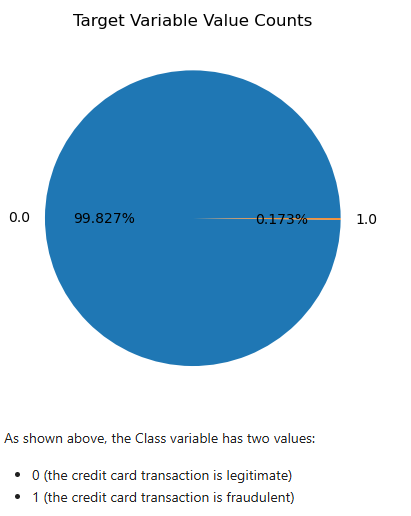
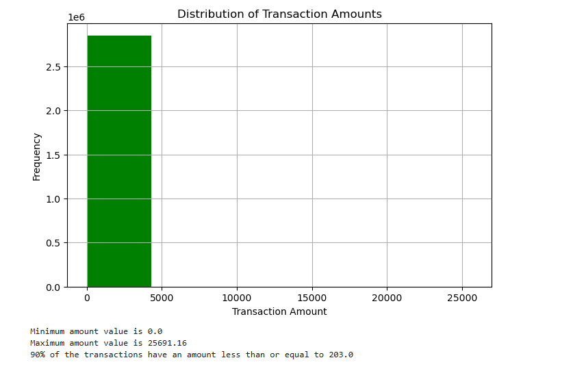
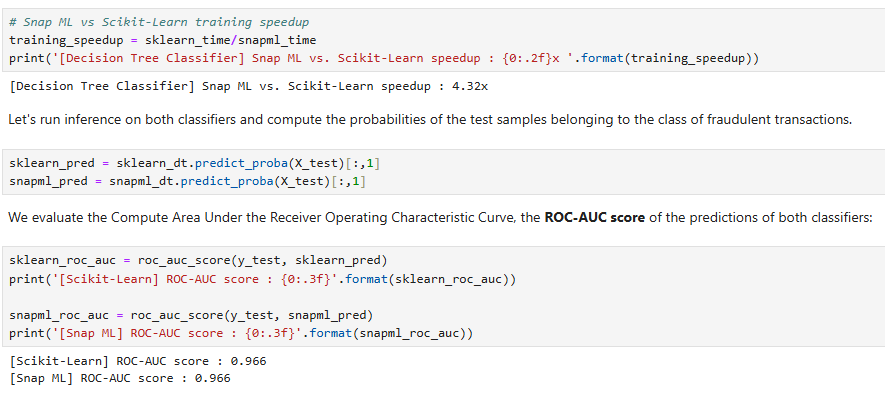
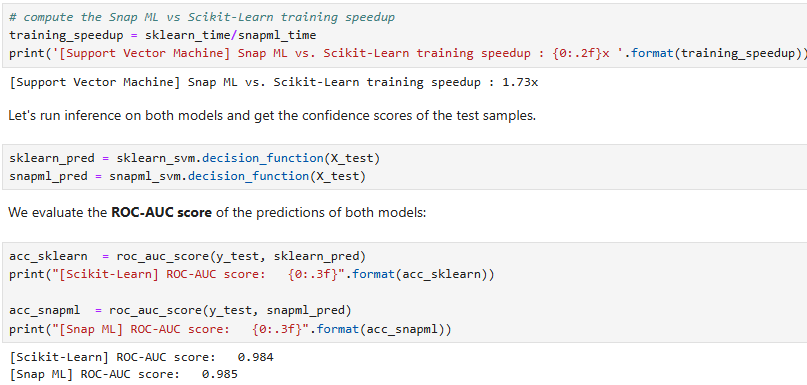

# Credit Card Fraud Detection 🕵️‍♀️💳

This project aims to detect fraudulent credit card transactions using supervised learning methods like Scikit-Learn and Snap ML (IBM's optimized ML library).

---

## 📊 Key Highlights:

- ✅ Dataset: Anonymized credit card transactions
- 🧠 Models Used: Linear SVM (Scikit-Learn & Snap ML), Decision Trees
- 🧪 ROC-AUC Score: **0.966** (both models)
- 📉 Hinge Loss:
  - Scikit-learn SVM: **0.234**
  - Snap ML SVM: **0.228**
- ⚡ Snap ML training was significantly faster than Scikit-learn!

---

## 🧰 Tools & Libraries

- Python
- Jupyter Notebook
- Scikit-learn
- IBM Snap ML
- Matplotlib, Seaborn

---

## 📁 Files Included

| File | Description |
|------|-------------|
| `credit_card_fraud_detection_using_scikit-learn_and_snap_ml.html` | Final project notebook in HTML |
| `.ipynb` file (optional) | Jupyter notebook  |
| `README.md` | Project overview |

---

## 🧠 Lessons Learned

- How to handle imbalanced datasets using class weights
- Hinge loss vs. ROC-AUC comparison
- Using Snap ML for faster ML training
- Confidence scores with `decision_function()` for SVMs

---

## 📸 Screenshots

---

## 📌 Credits

Project completed as part of IBM CognitiveClass.ai  
Badge/certificate available on project completion ✅

---
